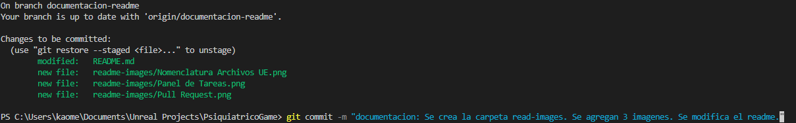

#  $${\color{yellow}PSYCHIATRIC\space GAME\space}$$
Creación de video juego de terror y suspenso hecho en UE5 y Bleder.

Autores: Romero Ana y Sandoval Mario. 

##    ${\color{white}Tabla\space de\space Contenidos\space}$

- [HISTORIA](#historia)
- [Instalación](#instalación)
- [Contribución](#contribución)
- [Aprobación](#aprobación)
- [Créditos](#créditos)
- [Tareas](#tareas)


## ${\color{orange}HISTORIA}$
---
Estamos en un hospital psiquiátrico, somos el personaje principal quién es hija de la directora del lugar, que recibió una llamada del psiquiátrico diciendo que es "la única que puede ayudarnos", decide ir al lugar a ver qué sucedía.

Tiene un amigo mascota.

Al llegar al lugar, aparentemente no hay nadie afuera, la entrada estaba bloqueada con contraseña. Investiga, ingresa.

Observa la recepción y estaba todo oscuro, comienza a ver que cada habitación de paciente estaba rara.
Observa las fichas de los pacientes.
Cada habitación tenía un objeto en particular que si era tocado te teletransportaba al sueño o mundo del paciente.
Para salir de allí era fundamental conocer la ficha del pj, saber a qué temía para poder enfrentar sus miedos, y conocer que le gustaba para resolver los acertijos.

Al final, el pj se había metido en un mundo mucho más grande, puesto que no podía salir del hospital cuando se da cuenta, entonces esta en un mundo que contiene todos los mundos de los personajes.

Para salir de allí debe encontrar pistas de quién puede ser la persona en donde está metido.

El psiquiátrico en sí es todo un mundo que sin querer la madre había creado a partir de los miedos y alucinaciones de los personajes.
Pero los pacientes que verdaderamente podían hacerlo eran muy pocos, eran los tratados como locos por "alucinar", ella los detectaba y los coleccionaba.
Creo toda una maquina para que haya una conexión abierta entre esas alucinaciones y los pacientes, pero todo se sale de control, la maquina se rompe por un paciente (importante, es el padre de la chica), la madre ya había notado que este tenía fuertes alucinaciones.
Ahí es cuándo se sale de control todo y el personaje principal ingresa a este lugar ya siendo una "ilusión".


## ${\color{orange}Instalación}$
---
Se trabajará con la plataforma Unreal Engine (ver version) y Blender.


## ${\color{orange}Contribución}$
---
  ### ${\color{white}Guía\space de\space Contribución}$
  
  Hacer un **fork** del repositorio

  git pull (mantener la rama actualizada para evitar conflictos)

  git status (comando para verificar cómo se encuentra la rama)

  git add . (para agregar todos los cambios en la rama)

  git commit - m "comentario" (para agregar comentario a los cambios *ver Estándares de Código*)
  
  >[!CAUTION] 
  > Lo siguiente se realiza siempre y cuando las Condiciones de Aprobación estén dadas.
  ```
    git push
    Generar un Pull Request
  ```
  > [!TIP]
  > **[¿Cómo hacer un Fork y un Pull Request?](https://www.youtube.com/watch?v=BPns9r76vSI)**.

  ### ${\color{white}Estándares\space de\space Código}$
  - Los nombres de las ramas deben ser: etiqueta-nombreDeLaTarea
  - Los commits deben tener la siguiente nomenclaruta: etiqueta: queseagregaocrea

  Ejemplo de commit:

  

  Vista de los commits en Github

  

  **Notese que el primer commit no tiene bien su nomenclatura.*

  > [!NOTE]
  > Los commits no deberían ser largos ni tener más de 5 o 6 acciones. Es mejor hacer paso a paso y llevar un control de cambios para que los miembros del equipo puedan entender cada cambio.

  ### ${\color{white}Estándares\space de\space Estructura\space en\space Unreal\space Engine}$
  Blueprints

  - Los Blueprints deben estar organizados, cada sección debe tener un contenedor con el título que informe el qué hace cada parte del BluePrint.
  - Añadir comentarios en los BluePrints en las partes que se pueden modificar, por ejemplo: si el personaje corre y se puede regular su velocidad, indicar con un comentario sobre el valor en donde se puede modificar ese valor.
  
  Estructura de Carpetas
 
  + *Content*
     - Blueprints: Carpeta para todos los Blueprints del proyecto.
     - Characters: Blueprints específicos de personajes.
     - Controllers: Blueprints para controladores de juego.
     - UI: Blueprints para la interfaz de usuario.
  + *Meshes: Modelos 3D utilizados en el proyecto.*
    - Characters: Modelos de personajes.
    - Environment: Modelos de entornos.
    - Props: Objetos y accesorios.
  + *Textures: Texturas utilizadas en el proyecto.*
    - Characters: Texturas de personajes.
    - Environment: Texturas de entornos.
    - Props: Texturas de objetos.
  + *Materials: Materiales utilizados en el proyecto.*
    - Characters: Materiales de personajes.
    - Environment: Materiales de entornos.
    - Props: Materiales de objetos.
  + *Animations: Animaciones utilizadas en el proyecto.*
    - Characters: Animaciones de personajes.
  + *Audio: Archivos de sonido y música.*
    - Music: Música de fondo.
    - SFX: Efectos de sonido.
  + *Maps: Niveles y mapas del juego.*
    - Main: Mapas principales.
    - Test: Mapas de prueba.
  + *UI: Recursos de la interfaz de usuario.*
    - Widgets: Widgets de UI.
    - Textures: Texturas utilizadas en la UI.
  + *Particles: Sistemas de partículas utilizados en el proyecto.*
  + *Scripts: Scripts específicos del proyecto.*
    - Python: Scripts en Python.
    - Editor: Scripts para automatización en el editor.
  + *Shaders: Sombras y materiales personalizados.*
  + *Misc: Cualquier otro recurso que no encaje en las categorías anteriores.*

  ### ${\color{white}Nomenclatura\space Recomendada\space para\space la\space Creación\space de\space Archivos\space}$
*Prefijos y Sufijos*

    Utilizar prefijos y sufijos descriptivos ayuda a identificar rápidamente el tipo de archivo y su propósito. 
  
  Aquí las convenciones:

  - Blueprints: **BP_**
  - Textures: **T_**
  - Materials: **M_**
  - Static Meshes: **SM_**
  - Skeletal Meshes: **SK_**
  - Animations: **A_**
  - Particle Systems: **P_**
  - Sound Effects: **S_**
  - Music: **MUS_**
  - User Interface: **UI_**
  - Levels: **LVL_**
  - Widgets: **W_**

    

### ${\color{white}Política\space de\space Pull\space Requests}$   
  
 - Cada Pull Request deberá solucionar solo una tarea sacada del Kanban del Projects.
 - Cada Pull Request debe funcionar y respetar los Estándares de Código. 
 - Cada Pull Request debe tener un título que debe seguir la siguiente nomenclatura: Etiqueta de tarea: título de tarea
 - Cada Pull Request debe tener en su descripción el enlace a la tarea que corresponde. [ver Panel de Tareas](https://github.com/users/AnaMariaRomero/projects/2/views/1)
 - Cada Pull Request debe tener en su descripción el enlace con el video o documentación que se utilizó para resolver la tarea.

Ejemplo de creación de un Pull Request:


Vista de un Pull Request creado


*Notese el uso de los labels*

> [!NOTE]
> Los labels de tareas serán: documentación - bugs - help -  issue - task

##  ${\color{orange}Aprobación}$
---
  _Condiciones_
  - Respetar Estandares de Código y Estructura de Unreal Engine y la Política de Pull Requests.

##  ${\color{orange}Tareas}$
---
  - Las tareas de sacarán del [Panel de Tareas](https://github.com/users/AnaMariaRomero/projects/2/views/1).

  
  - Cada tarea nueva a agregar serán discutidas por los miebros del equipo una vez que se encuentre realizado el prototipo.
  - Cada tarea debe especificar qué hace.
  - Cada tarea debe ser concisa y lo más puntual posible.  
  - Cada miebro del equipo, cuando elija una tarea, debe asignarsela.


## ${\color{orange}Créditos}$
---
  AnitaLaHuerfanita - ElMario
